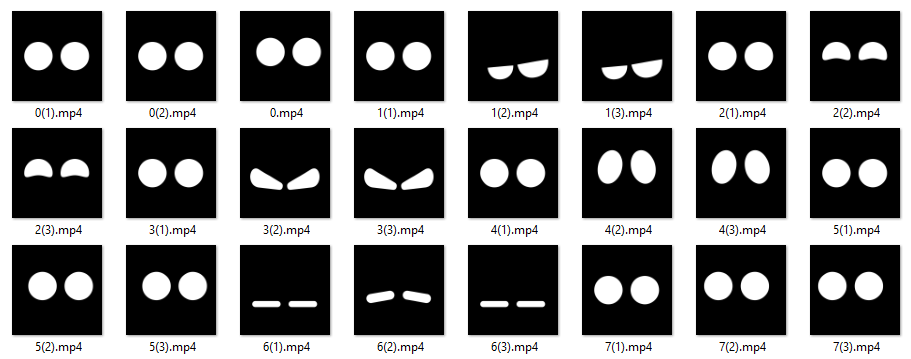

<p align="center"></p>
<h1 align="center">Face Robot 2</h1> 
<h4 align="right">apr 23</h4>


<br>

# Summary
Son 24 animaciones que expresan emociones en una website. Agrupados en 7 emojis de 3 videos cada uno.

## Comandos
```2 digitos``` - ej(16) 1er digito el emoji, 2do digito el tiempo en que va a permanecer el emoji stantad sin parpadear.

```3 digitos``` - ej(126) 1er digito es el video del emoji, 2do es el video video especifico de la animacion, 3ero es el tiempo de espera para parpadear nuevamente

## Testing:
abrir carperta desde VS  y activar live server

> :memo: **Note:**
- Los Videos 0(x) son para el parpadeo
- Resolución de prueba 600x400 pixeles

<br>

## Testing en una RPI:
Copiar el repositorio en una carpeta GUI-face, manteniendo esta estructura:
```
  /GUI-face
      /server.js
      /build
         /index.html
         /emoji
         /js
         /css
         /media
```
Instalar NodeJs & NPM: https://github.com/carjavi/install-nodejs-ARM

Instalar los siguiente librerias:
```
npm i express
npm i http
```
correr el server:
```
node server.js
```
en el Browser `ip:8080` podremos observar nuestra `face-robot2`

<br>

---
Copyright &copy; 2022 [carjavi](https://github.com/carjavi). <br>
```www.instintodigital.net``` <br>
carjavi@hotmail.com <br>
<p align="center">
    <a href="https://instintodigital.net/" target="_blank"></a>
</p>